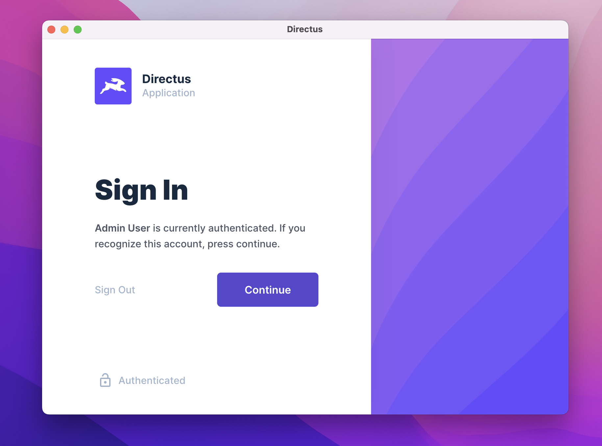

# Directus electron

This is a minimal Electron project generated with [electron-quick-start template](https://github.com/electron/electron-quick-start) that allows you to run directus inside a desktop app.


### Version

1.0.0

## Usage

### Installation

Install the dependencies

```sh
$ npm install
```

### Configuration

Edit app/config.js file

```javascript
module.exports = {
  appUrl: "https://yourdomain.com",
  windowWidth: 800,
  windowHeight: 600,
};
```

### Serve

To run electron

```sh
$ npm start
```

### To Package & Build

For Windows

```sh
$ npm run package-win
```

For Mac

```sh
$ npm run package-mac
```

For Linux

```sh
$ npm run package-linux
```

### License

[MIT License](LICENSE.md)
